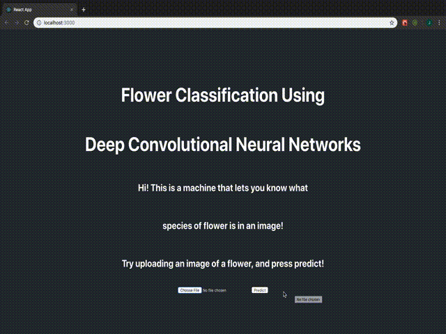

# pytorch-flask-react
Deployment of a Pytorch CNN Classification Model on a Flask API with React Front-End Integration

To run locally:

- Install Python3
- Clone repository `git clone https://github.com/al-jshen/ptfr-flower.git`
- Enter cloned directory `cd pytorch-flask-react`
- Go to the backend `cd flask-backend`
  - Install dependencies `pip3 install -r requirements.txt`
  - Deploy the model `python3 deploy.py`
- Open another terminal
- Go to the frontend `cd pytorch-flask-react/react-frontend`
  - Install dependencies `npm install`
  - Run the app `npm start`
- Open a web browser and go to `http://localhost:3000`
- ???
- Profit!

